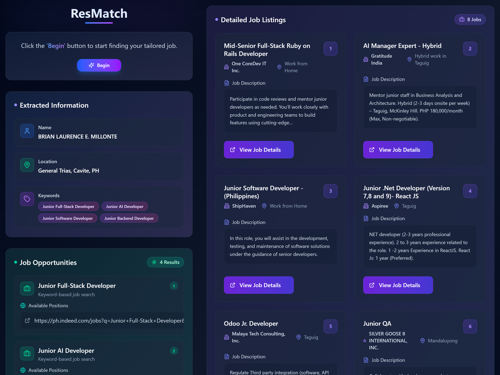

# 🧠 Resmatch

**AI-powered job discovery from your resume.**  
Upload your resume, and Resmatch will find tailored, up-to-date job listings — no filters, no noise.

---

## 🚀 Overview

Resmatch is a web app designed for developers, engineers, and tech professionals who are actively looking for jobs. It uses AI to extract meaningful data from a resume, generates relevant job search keywords, builds smart search URLs (e.g. for Indeed), and crawls live listings using Firecrawl. The results are clean, structured job listings that match your profile — instantly.

---

## 🧩 Features

- 📄 **Resume Upload (PDF)**
- 🔍 **AI-powered Keyword Extraction**
- 🌐 **Automated Job URL Builder (Indeed, RemoteOK, etc.)**
- 🧠 **Live Job Listing Scraper using Firecrawl**
- 📊 **Structured Output (title, description, salary, apply link)**
- 🧭 **Optional User Preferences: location, job type, remote-only**
- 💡 **Skill-Gap Insight (Coming Soon)**

---

## 📸 Preview

---

## 🛠️ Tech Stack

| Layer      | Technology                                       |
| ---------- | ------------------------------------------------ |
| Frontend   | React / Next.js, Tailwind CSS & Shadcn UI        |
| Backend    | Next API Routes                                  |
| AI         | Mistral AI                                       |
| Scraper    | Firecrawl API                                    |
| Parsing    | `pdf-parse` for extracting text from PDF resumes |
| Deployment | Vercel                                           |

---

## 🧪 How It Works

1. **User uploads resume**
2. Resume is parsed using `pdf-parse` and passed to a tool
3. The tool returns 5–10 job search keyword phrases
4. Another tool call builds smart Indeed URLs based on:
   - Keywords
   - Location
   - Job type
   - Remote preference
5. Firecrawl scrapes those URLs for live job listings
6. The scraped data is passed to another tool
7. The tool returns a structured list of jobs with the following fields:
   - Title
   - Description
   - Salary
   - Apply link
8. The structured data is displayed back to the user

---

## 📌 Roadmap

- [x] Resume upload and parsing
- [x] AI-powered keyword generator
- [x] Indeed URL builder
- [x] Firecrawl integration
- [ ] Skill-gap analysis & learning suggestions
- [ ] Weekly job email digest
- [ ] User dashboard & saved jobs
- [ ] Apply tracker

---

## 🧑‍💻 Author

Built by [@briuwu](https://brianmillonte.vercel.app)

Open to collaboration or feedback!

---

## 🌟 Support

If you find this project helpful, consider ⭐ starring the repo and sharing it with others!
